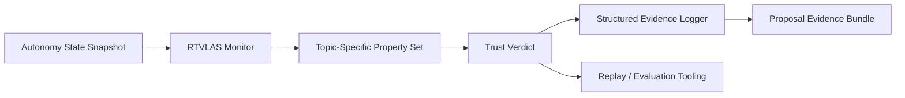

# Architecture

This repository adapts RTVLAS for **DAF26BZ01-NV006 Intelligent Threat Aware Autonomy**.

## System Role

**Opening angle:** sanity checker for threat-aware autonomy; mission path/constraint assurance layer

## Runtime Elements

- `core/`: monitor, property framework, evidence writer
- `bindings/`: C ABI for external autonomy stacks
- `tooling/replay/`: deterministic replay of autonomy traces
- `tooling/eval/`: scenario evaluator and artifact generation
- `evidence/`: pre-generated scenario outputs for reviewers

## Topic Adaptation

The property set in this repository is tuned for:

- Threat Standoff Margin
- WEZ Exposure Bound
- Route Efficiency Floor
- Mutual Support Deconfliction Margin
- Weapon / Action Feasibility
