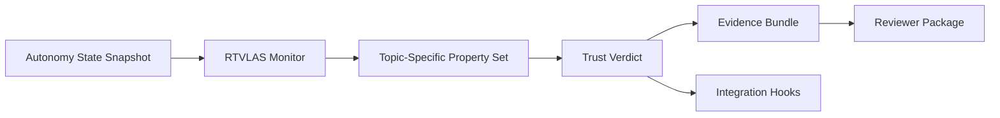

# Technical Volume

## 1. Technical Thesis

The proposal opens with the following angle: **sanity checker for threat-aware autonomy; mission path/constraint assurance layer**.

RTVLAS is not proposed here as the primary autonomy engine. It is proposed as the supervisory runtime layer that determines when autonomy outputs should no longer be trusted. That positioning is well matched to the current submission posture because it focuses on interface definition, safety property construction, and low-order scenario evidence rather than expensive airworthiness-scale integration.

## 2. Solicitation-Specific Fit

**Track posture:** Phase I

**Objective fit:** Advance one or more core ITA2 design challenges, especially WEZ modeling, WEZ avoidance, advanced weaponeering, and mutual-support behaviors for ACPs.

This repository is explicitly shaped around the following solicitation needs:

- WEZ-aware risk measurement and route sanity checking
- avoidance behavior for multiple static or moving threats
- weapon-task or action feasibility checks tied to mission context
- mutual-support and deconfliction logic for collaborative ACP behaviors

**Deliberate scope boundary:** This repository focuses on verifying threat-aware behaviors and mission outputs at runtime; it does not attempt to replace the underlying threat-aware planner or inner-loop vehicle controller.

## 3. Problem

Threat-aware autonomy can generate tactically sophisticated but operationally brittle courses of action that need a low-latency sanity layer before those commands are trusted in contested airspace.

## 4. Proposed Solution

RTVLAS adapted as a runtime assurance layer for threat-aware autonomy, checking whether generated paths and mission actions remain tactically sane in the presence of dynamic threats and deconfliction constraints.

The prototype consists of:

- a Rust runtime monitor that ingests autonomy state snapshots
- a property framework that evaluates topic-specific trust rules
- a structured evidence logger that writes JSON scorecards and human-readable proof logs
- replay and evaluation tooling for deterministic verification
- a C ABI that supports integration with existing autonomy stacks written in C or C++

## 5. Architecture

## 6. Topic-Specific Safety / Trust Properties

- **Threat Standoff Margin**: Ensures planned paths preserve minimum standoff distance from dynamic threats and engagement envelopes.
- **WEZ Exposure Bound**: Flags paths that accept excessive time inside modeled weapon engagement exposure corridors.
- **Route Efficiency Floor**: Detects threat avoidance plans that degrade mission efficiency below an acceptable tactical threshold.
- **Mutual Support Deconfliction Margin**: Preserves minimum spacing from friendly cooperative assets while threat responses are being executed.
- **Weapon / Action Feasibility**: Ensures the threat-aware autonomy has not collapsed into an internally infeasible route-and-engagement pairing.

## 7. Preliminary Feasibility Evidence

This repository includes three deterministic scenarios that exercise both nominal and non-nominal behavior:

- **Nominal WEZ-Aware Mutual Support Route**: Threat-aware planner preserves standoff and route quality while maintaining cooperative spacing and action feasibility.
- **Overaggressive WEZ Skirt**: The planner remains feasible but accepts elevated WEZ exposure and reduced route efficiency while mutual-support margins begin to erode.
- **Unsafe WEZ Penetration and Action Failure**: Threat-aware autonomy collapses standoff, deconfliction, and action feasibility constraints, producing reject-grade mission behavior.

For each scenario, the package generates:

- `trust_scorecard.json`
- `timeline.json`
- `proof_log.txt`
- `trace.svg`

These artifacts provide preliminary data supporting the claim that the monitor can detect degraded or unsafe autonomy behavior while preserving a replayable evidence trail.

## 8. Differentiators

- low-compute runtime implementation in Rust
- clear C ABI for autonomy-stack integration
- property-based monitoring rather than opaque post hoc anomaly scoring
- deterministic replay and evidence regeneration
- direct claim-to-artifact traceability for reviewers

## 9. Execution Posture

The immediate objective is to mature this repository from a topic-tuned software prototype into a reviewer-verifiable package that defines architecture, interfaces, monitoring rules, evidence products, and a concrete path to next-phase integration.

## 10. End State

A runtime constraint-monitoring module for threat-aware autonomy outputs, suitable for integration with ACP path planners and mission managers.

## 11. Transition Path

Connect to a representative threat-aware planning stack, align with WEZ-aware simulations, and mature real-time interfaces to ACP mission computers.
